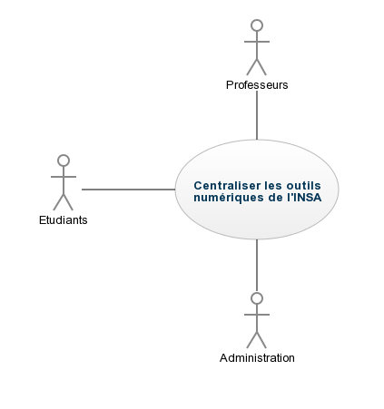

#I	Fondements du projet
##1. But du projet
###a. Problème de l’utilisateur ou contexte du projet 
Ce projet a été pensé pour répondre au problème d'échanges d'informations entre les membres de l'INSA. Il s'agit surtout d'une centralisation d'outils déjà existant.
###b. Objectifs du projet
Ce projet a pour objectif de faciliter l'échange d'informations entre élèves, professeurs et administration, en centralisant les outils numériques de l'INSA.
##2. Personnes et organismes impliqués dans les enjeux du projet 
###a. Maître d’ouvrage
L'équipe yapasdinfo.
###b. Acheteur
L'INSA.
###c. Autre parties prenantes
« Non Applicable (N/A) »
##3. Utilisateurs du produit
###a.	Utilisateurs directs du produit
Il y aura trois types d'utilisateurs de ce produit. Les membres de l'administration, les professeurs et les élèves.
Le public visé est toutes les personnes travaillant ou étudiant à l'INSA de Rouen, mais il pourrait être envisagé d'étendre ce service à tout le réseau INSA.
###b. Priorité assignée aux utilisateurs
Chaque classe d'utilisateurs aura à sa disposition les outils nécessaire à son travail. Les professeurs et l'administrations auront ainsi le pouvoir d'éditer certaines pages concernant par exemple les notes d'examens ou l'emploi du temps. Les élèves pourront poster sur le forum.
###c. Implication nécessaire de la part des utilisateurs dans le projet
L'administration devra maintenir à jour l'emploi du temps et signaler l'absence d'un professeur ou bien le changement de salle d'un cours.
Le professeur devra mettre à jour la liste des devoirs à faire pour les semaines à venir.
###d. Utilisateurs concernés par les opérations de maintenance du produit
« Non Applicable (N/A) »
#II	Contraintes sur le projet 
##4. Contraintes non négociables
###a. Contraintes sur la conception de la solution
Le produit doit être une application mobile.
###b. Environnement de fonctionnement du système actuel
###c. Applications « partenaires » (avec lesquelles le produit doit collaborer)
###d. « COTS » : Progiciels ou composants commerciaux
###e. Lieux de fonctionnement prévus
###f. De combien de temps les développeurs disposent-ils pour le projet ?
###g. Quel est le budget affecté au projet ?
##5. Glossaire et conventions de dénomination
##6. Faits et hypothèses utiles
###a. Facteurs influençant le produit, mais qui ne sont pas des contraintes imposées sur les exigences
###b. Hypothèses que l’équipe fait sur le projet 
#III	Exigences fonctionnelles
##7. Portée du travail 
###a. La situation actuelle
Le produit a pour objectif de remplacer en partie la plateforme moodle, le service mail de l'insa, l'agenda Sogo et l'espace numérique de travail normandie-université.
###b. Contexte du travail
Le produit devra pouvoir collecter les informations des différentes plateformes ci-dessus et donc communiquer avec les serveurs de l'INSA et de l'Université de Rouen.
###c. Division du travail en événements métier
« Non Applicable (N/A) »
##8. Portée du produit (cas d’utilisations)
###a. Limites du produit : diagramme de cas d’utilisation

###b. Description sommaire des cas d’utilisation
voir [Annexe I](#annexe-i)
##9. Exigences fonctionnelles et exigences sur les données
###a. Exigences fonctionnelles
| ID 	| Catégories 	| Description 	| Justification 	| Origine 	| Critères de satisfaction 	| Contentement MOA 	| Mécontentement MOA 	| Exigences Dépendantes 	| Exigences conflictuelles 	|
|----	|------------	|-------------	|---------------	|---------	|--------------------------	|------------------	|--------------------	|-----------------------	|--------------------------	|
|3|fonctionnel|Mise-à-jour de l'application en cas de modification sur Moodle/sogo/agenda|Synchroniser les modifications faite par les professeurs et l’administration sur l’application|MOA|Si il y a un changement sur un des outils INSA, l’application est modifié à la mise-à-jour suivante (connexion internet)|4|5|1,2| |
#IV	Exigences non fonctionnelles
##10. Ergonomie et convivialité du produit
« Non Applicable (N/A) »
##11. Facilité d’utilisation et facteurs humains 
« Non Applicable (N/A) »
##12. Fonctionnement du produit
« Non Applicable (N/A) »
##13. Adéquation du produit avec son environnement
###a. Environnement physique prévu
  L'application doit pouvoir être utilisée hors-ligne.
  Elle doit aussi demander un espace mémoire raisonnable sur le smartphone.
###b. Environnement technologique prévu
  Exigence matériel: pour utiliser l'application il faut disposer au minimum d'un smartphone android et éventuellement un iphone avec connexion internet.
###c. Applications « partenaires » (avec lesquelles le produit doit collaborer) 
  L'application doit pouvoir communiquer avec les serveurs de l'INSA, notamment l'agenda et moodle.
  Elle doit pouvoir se synchroniser automatiquement avec les serveurs de l'INSA.
  L'interface du planning doit être similaire à celle de l'agenda de l'insa pour une synchronisation plus facile.
  Les données à intégrer seront principalement du texte.
###d. Approche « produit » prêt à être commercialisé
  L'application doit pouvoir demander des confirmations de login et mot de passe aux serveurs de l'INSA.
##14. Maintenance, support, portabilité, installation du produit
« Non Applicable (N/A) »
##15. Sécurité
###a. Accès au système
  Les étudiants seront groupés par promotion et les professeurs seront associés aux groupes dans lesquels ils interviennent.
  Seuls les étudiants et personnels de l'INSA de Rouen pourront avoir accès au système.
  Seul le personnel de l'administration pourra modifier le planning.
  Seuls les professeurs pourront modifier les notes des élèves qui font partie de leurs groupes.
  Un étudiant ne pourra avoir accès qu'aux informations de son groupe.
  L'accès à l'application se fera via les identifiants de l'INSA de Rouen.
###b. Intégrité
  Une sauvegarde des données de l'application sera faite après chaque utilisation.
  En cas de crash, l'application utilisera la dernière sauvegarde valide enregistrée.
  Une synchronisation avec les données des serveurs de l'INSA sera faite à chaque fois que le smartphone sera connecté à internet.
###c. Protection des données à caractère personnel
 L'application protègera les données à caractère personnel conformément aux lois applicables concernant ces données
###d. Audit et traçabilité
###e. Protection contre les infections
  L'application doit être capable de prévenir l'utilisateur lorsqu'une autre application non autorisé tentera d'accéder aux données.
##16. Exigences culturelles et politiques 
« Non Applicable (N/A) »
##17. Lois et standards influençant le produit
« Non Applicable (N/A) »
#Annexe I
##Liste des exigences utilisateur

| ID 	| Catégories 	| Description 	| Justification 	| Origine 	| Critères de satisfaction 	| Contentement MOA 	| Mécontentement MOA 	| Exigences Dépendantes 	| Exigences conflictuelles 	|
|----	|------------	|-------------	|---------------	|---------	|--------------------------	|------------------	|--------------------	|-----------------------	|--------------------------	|
|4|utilisateur|Disposer d'un forum par promotion|Être mis au courant des changement d’horaires, discuter sur les TD difficiles etc|MOA|Existence d’au moins un forum par promotion étudiante|4|3|||
|7|utilisateur|Vérifier la véracité des informations circulantes|Éviter la circulation de rumeurs|MOA|Pour chaque post, il faut un bouton « confirmé », les autres utilisateurs peuvent cliquer dessus pour valider et peuvent voir le nombre de validation|4|1|||
|8|utilisateur|Planning devoir à rendre/à faire|Pour l’organisation de l’utilisateur|MOA|Présence d’un planning personnel |2|1|13||
|10|utilisateur|Système de communication professeur/étudiants pour les absences et notes et infos diverses|Mise en place d’une communication plus directe entre professeurs et élèves|MOA|Un utilisateur de la catégorie professeur peut envoyer les informations à un ou plusieurs individus|3|4|||
|11|utilisateur|Système de feedback|Permettre au professeur de connaître le nombre d’étudiant ayant vu l’information postée|MOA|Compteur de personne ayant vu un post|4|1|||
|12|utilisateur|Choisir sur quels sujets l’utilisateur souhaite recevoir des notifications|Eviter un flux trop important d’information inutile pour l’utilisateur|MOA|Système de préférence de l’utilisateur|5|3|||
|13|utilisateur|Notification d’échéances|Ne pas oublier certains évènements apparaissant sur le planning|MOA|Si un événement sur le planning est prévu pour le lendemain, on reçoit une notification|2|1|||

